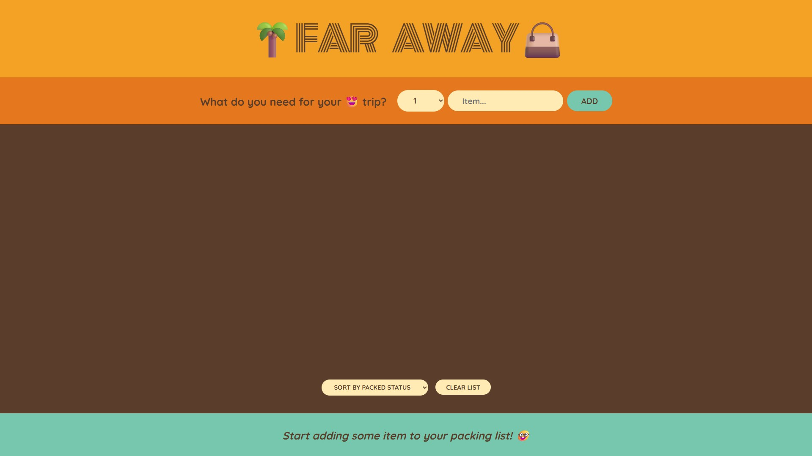
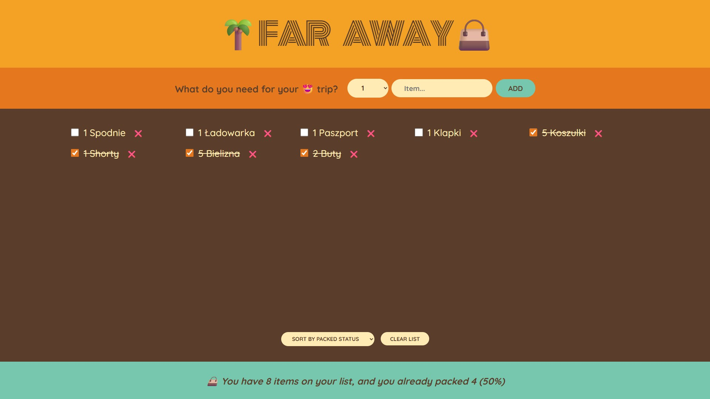
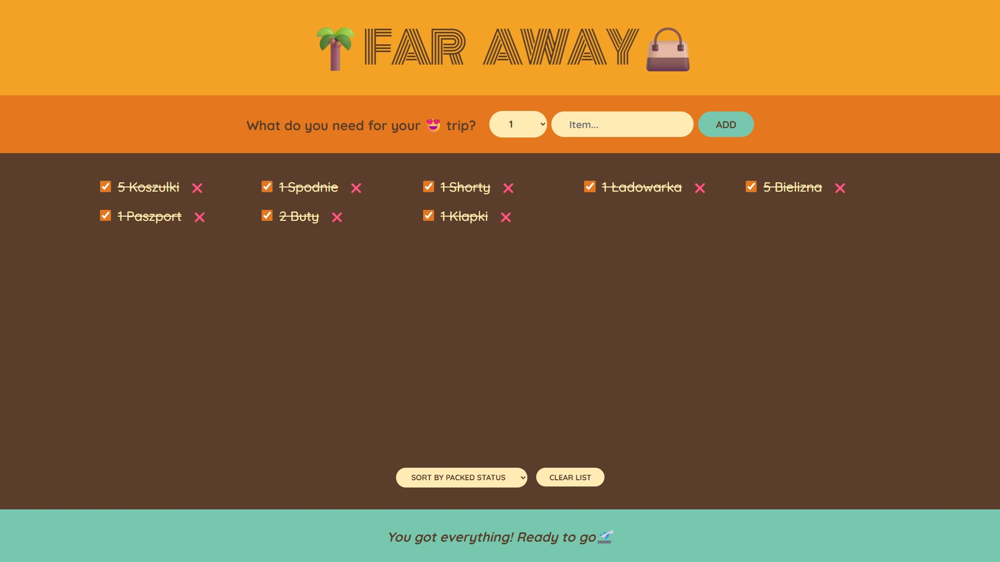
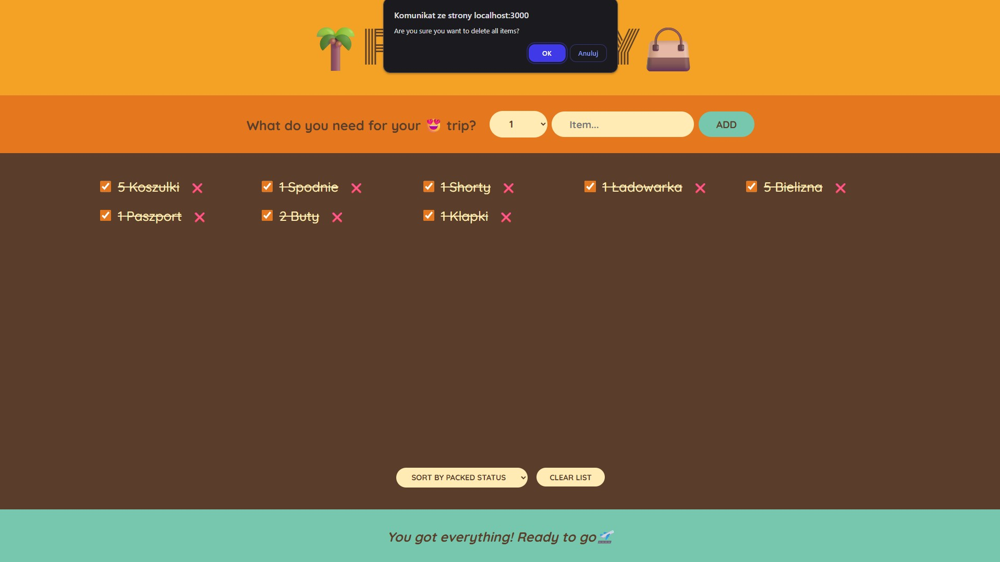

# 🧳 Far Away Packing List (03)

Trzeci mini-projekt wykonany w ramach kursu **"The Ultimate React Course 2025"** autorstwa Jonasa Schmedtmanna.

Jest to prosta aplikacja do zarządzania listą rzeczy do spakowania przed podróżą. Projekt koncentruje się na zarządzaniu stanem, m.in. `lifting state up`, `derived state`, formularzach oraz renderowaniu dynamicznych list.

---

## 🔧 Funkcjonalności

- Dodawanie przedmiotów do listy z określeniem ilości
- Oznaczanie przedmiotów jako spakowane
- Usuwanie pojedynczych przedmiotów z listy
- Statystyki: liczba przedmiotów, ile spakowano
- Resetowanie całej listy

---

## 🧠 Czego się nauczyłem

- **Lifting state up** – przenoszenie stanu do komponentu nadrzędnego
- **Derived state** – obliczanie danych na podstawie istniejącego stanu (statystyki)
- Obsługa formularzy w React
- Zarządzanie tablicami obiektów w stanie (`useState`)
- Renderowanie warunkowe
- Tworzenie prostych komponentów funkcyjnych

---

## 📸 Podgląd

<p align="center">
  
  
  
</p>

<p align="center">
  
  
</p>

---

## 🚀 Live demo

🌐 *Link do wersji live (do uzupełnienia)*

---

## 🗂️ Stack technologiczny

- React (Create React App)
- JavaScript (ES6+)

---

## 📁 Uruchamianie lokalnie

```bash
git clone https://github.com/awitkowsky/react-far-away.git
cd react-far-away
npm install
npm start
